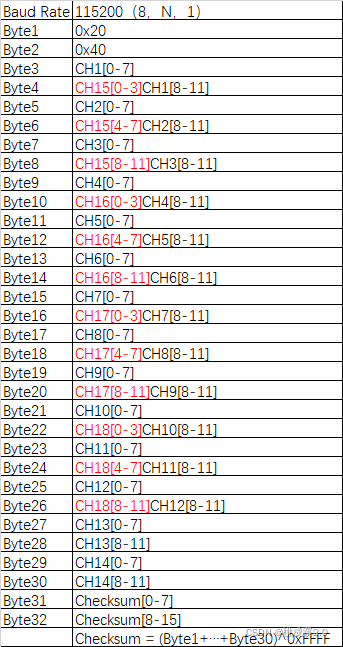
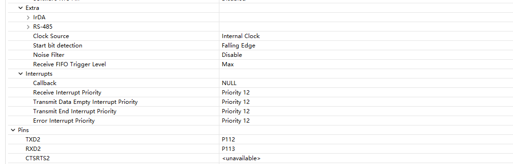

# 在野火启明RA4M2开发板上实现DMAC串口接收i-bus协议遥控器数据

## 开发环境
- **IDE**: Keil5 5.38a（AC6编译器）+RASC（5.80）
- **芯片**: R7FA4M2AD3CFP （Cortex-M33  128KB/512KB Code Flash 和 8KB Data Flash）
- **开发板**: 野火瑞萨启明4M2 


## i-bus协议简介

&emsp;&emsp;ibus协议作为一种遥控器接收机协议。是富斯牌遥控器常用的一种接收机协议。该协议是一种串口协议,相较于SBUS和DBUS协议来说，串口配置和有所不同，且不需要取反电路，只需要标准串口接收电路即可。


### 协议内容如下：



### 解包函数
```C
static uint8_t  rx_buffer[32] = {0};
static uint8_t  rx_buffer_from_dma[64] = {0};
static uint8_t  rx_buffer_initial_find[64] = {0};
uint16_t channel[IBUS_USER_CHANNELS] = {0};         //最终解包后遥控器通道数据(此处用全局变量是为了debug使用监视点实时观察)
static uint16_t checksum_cal, checksum_ibus;

fs_ia6b_ibus_t rc_data;

/***********************************************************************************************************************
 * 数据接收buffer初步处理函数
 **********************************************************************************************************************/

static int ibus_initial_unpack(void)
{
    for (int i=0;i<64-32;++i)//确保检测到的字节数为32字节，防止copy溢出
    {
        if (rx_buffer_initial_find[i]==IBUS_start1&&rx_buffer_initial_find[i+1]==IBUS_start2)  //根据通信协议从buffer中找出数据帧
        {
            memcpy(rx_buffer,&rx_buffer_initial_find[i],32);
            return 0;
        }
    }
    return 1;
}

/***********************************************************************************************************************
 * ibus通信协议解包函数
 **********************************************************************************************************************/
void ibus_unpack()
{
    if (ibus_initial_unpack()==0)
    {

    uint16_t channel_buffer[IBUS_MAX_CHANNLES] = {0};

    if(rx_buffer[0] == IBUS_start1 && rx_buffer[1] == IBUS_start2)
    {
        checksum_cal = 0xffff - rx_buffer[0] - rx_buffer[1];

        for(int i = 0; i < IBUS_MAX_CHANNLES; i++)
        {
            channel_buffer[i] = (uint16_t)(rx_buffer[i * 2 + 3] << 8 | rx_buffer[i * 2 + 2]);
            checksum_cal = checksum_cal - rx_buffer[i * 2 + 3] - rx_buffer[i * 2 + 2];
        }

        checksum_ibus = (uint16_t)(rx_buffer[31] << 8 | rx_buffer[30]);

        if(checksum_cal == checksum_ibus)
        {
            for(int j = 0; j < IBUS_USER_CHANNELS; j++)
            {
                channel[j] = channel_buffer[j];
            }
            memcpy(&rc_data,channel,sizeof(fs_ia6b_ibus_t));
        }
    }

    }
}

```


## 例程应用思路

&emsp;&emsp;该协议与sbus和dbus协议类似，仅稍作改变即可实现对应协议。

&emsp;&emsp;该接收方式使用DMAC+空闲中断，属于串口的高效应用，有效节约CPU资源。

&emsp;&emsp;该例程仅在裸机中配置，属于一个简单应用示例，具体复杂应用还请各位发散使用。

## 配置思路

### 1.串口配置

&emsp;&emsp;串口配置使用RASC进行配置，根据i-bus协议。波特率115200、8位数据位、1位停止位、无校验位（ibus协议有自己的校验方法）。

&emsp;&emsp;不需要设置中断回调函数，中断回调函数在DMAC的配置中实现。




### 2.DMAC配置

&emsp;&emsp;下面是DMAC的配置设置，采用正常模式，因为串口接收设置接收的单个数据为8bit，所以配置`Transfer Size`为`1Byte`。
&emsp;&emsp;配置`Number of Transfers`为`64`是因为i-bus协议的单帧数据长度为32字节，一次接收的字节量为64字节可以保证其中至少能稳定解析出一个完整帧。


```C
/***********************************************************************************************************************
 * ibus接收串口初始化函数
 **********************************************************************************************************************/

void ibus_init(void)
{
		fsp_err_t err;
	
    /* 配置串口接收 DMA 源地址、目标地址、长度 */
	  
		err =R_DMAC_Reset (g_transfer_dmac_sci2_rx.p_ctrl,
                        (void const * volatile)(&R_SCI2->RDR),
                        rx_buffer_from_dma,
                        sizeof(rx_buffer_from_dma));
		assert(FSP_SUCCESS == err);
   
	  err =R_DMAC_Open (g_transfer_dmac_sci2_rx.p_ctrl, g_transfer_dmac_sci2_rx.p_cfg);
		assert(FSP_SUCCESS == err);
	  err =R_DMAC_Enable (g_transfer_dmac_sci2_rx.p_ctrl);
		assert(FSP_SUCCESS == err); 
		err =R_SCI_UART_Open(g_uart2_ibus.p_ctrl,g_uart2_ibus.p_cfg);
		assert(FSP_SUCCESS == err);
	  
}

/***********************************************************************************************************************
 * DMAC接收中断回调函数
 **********************************************************************************************************************/
void dmac_sci2_rx_callback(dmac_callback_args_t *p_args)
{
    (void)p_args;
	
    memcpy(&rx_buffer_initial_find,rx_buffer_from_dma,sizeof(rx_buffer_from_dma));  //复制接收buffer到数据处理buffer中
	 
    R_DMAC_Disable (g_transfer_dmac_sci2_rx.p_ctrl);                                //失能DMA
    R_DMAC_Reset (g_transfer_dmac_sci2_rx.p_ctrl,
                        (void const * volatile)(&R_SCI2->RDR),                      //重新配置DMA接收初始地址
                        rx_buffer_from_dma,
                        sizeof(rx_buffer_from_dma));
    R_DMAC_Enable (g_transfer_dmac_sci2_rx.p_ctrl);                                 //使能DMA
} 

```
### 3.串口打印解包结果


## 项目源码仓库

  [https://github.com/DAMIAN-CHEN/LPC1114_RTT.git]
